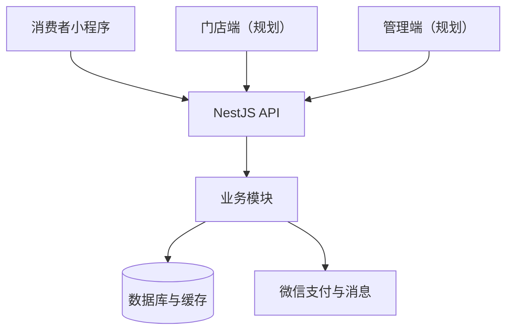

# 项目架构

## 总体结构

黑米姐姐采用前后端分离的 Monorepo。消费者小程序、API 服务和共享业务模型统一管理，以减少接口字段不一致和重复维护。

## 分层约定

- `apps/`：直接面向用户或运营人员的应用。
- `services/`：后端服务，首期采用模块化单体，避免 MVP 阶段过早拆分微服务。
- `packages/`：前后端可复用的类型、常量和工具。
- `docs/`：架构、开发、接口与业务规则文档。

## 首期业务模块

| 模块   | 职责                         | 首期优先级 |
| ------ | ---------------------------- | ---------- |
| 用户   | 微信登录、用户资料与授权     | P0         |
| 门店   | LBS 查询、营业状态、门店切换 | P0         |
| 商品   | 分类、详情、规格与门店库存   | P0         |
| 购物车 | 门店校验、数量与价格计算     | P0         |
| 订单   | 创建、支付、备货、取货与取消 | P0         |
| 售后   | 退款申请与处理               | P1         |
| 营销   | 优惠券、积分和社区拼团       | P1/P2      |
| 物流   | 仓储到门店的轨迹展示         | P2         |

## 关键设计原则

1. 订单、库存、支付和退款必须采用明确的状态机，状态变更保持幂等。
2. 商品价格和库存按门店隔离，切换门店后必须重新校验购物车。
3. 小程序不保存业务密钥，微信支付签名等操作只在服务端执行。
4. MVP 阶段使用模块化单体；当业务量和团队规模需要时再拆分服务。
