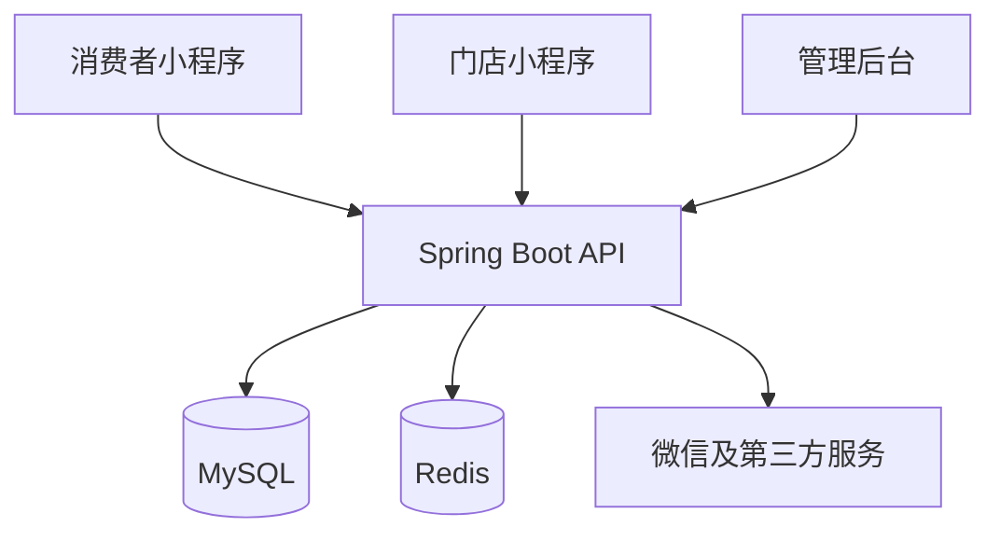

# 系统架构

## 架构选择

项目采用“多前端 + 模块化单体后端”的方式：

- 消费者小程序和门店小程序使用 Taro + React。
- 管理后台使用 React + Vite + Ant Design。
- 后端使用 Java + Spring Boot，一个进程内按业务能力分模块。
- MySQL 保存业务数据，Redis 保存缓存、验证码和短期状态。
- 微信登录、微信支付、短信和对象存储统一放在 `integration` 层。

## 调用关系

## 模块边界

业务模块不得直接访问其他模块的 Mapper。跨模块操作通过 Service 接口或领域事件完成。订单模块负责订单状态，库存模块负责库存变动，支付模块负责支付流水，退款模块负责退款流水。

## 暂不采用微服务的原因

MVP 阶段只有两名开发者，模块化单体能够减少部署、链路追踪和分布式事务成本。后续只有在团队、访问量或业务边界明确增长时再拆分服务。
